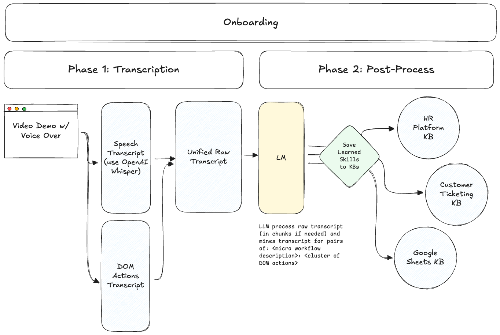
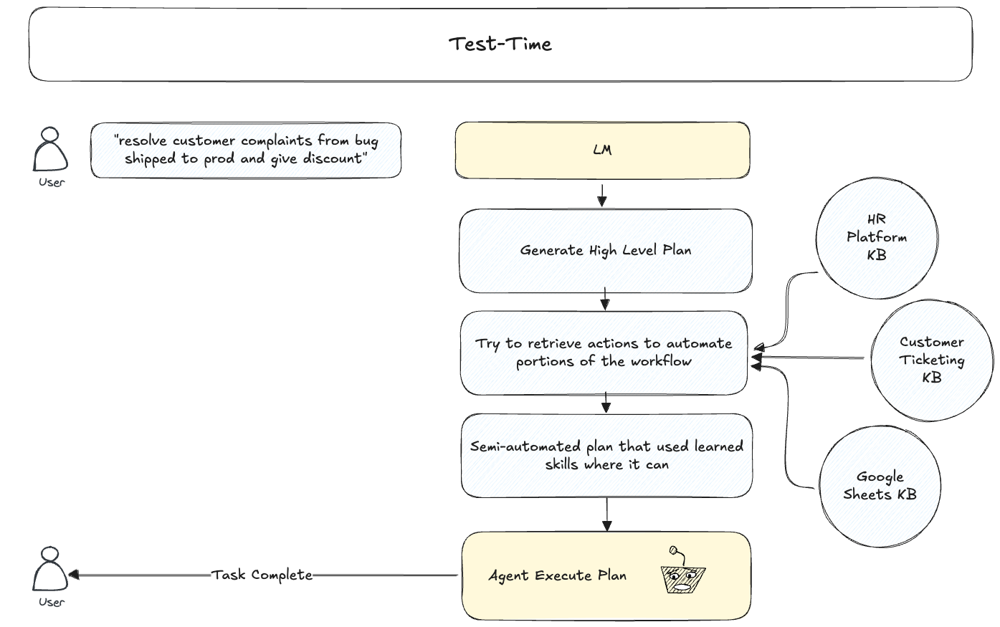

# Onboarding Agents: A Framework Enabling Web Agents to Master Workflows From Human Demonstration

A system that enables web agents to learn from human demonstrations of browser workflows and execute them with higher reliability through test-time retrieval of learned trajectories.

<p align="center"></p>
<p align="center"></p>


## Architecture Overview

### 1. Recording & Transcription
- Simultaneously:
  - Records user speech using OpenAI Whisper (segmented by pauses)
  - Generates playwright code to replicate the users exact actions using [Playwright Codegen](https://playwright.dev/python/docs/codegen)
- LLM refactors and annotates the playwright code, grouping together atomic action seqences (i.e "add an item to the todo list") into functions
- Refactored playwright code is a library of composable, learned sub workflows that can be retrieve at test-time
  - Here is an example of the output of this step: [src/workflows/todo-app-trancript-2/refactored_workflow.py](src/workflows/todo-app-trancript-2/refactored_workflow.py)

### 2. Workflow Ingestion
- Ingest new workflows, from the above step, into an existing knowledge base / libary of learned subworkflows
- Use store basic file system index or store in vector DBs

### 3. Skill Retrieval
- Exposes API endpoint for agent to query
- Retrieves relevant skills based on natural language descriptions
- Returns ranked list of potential skills to leverage

### 4. Agent Execution (TypeScript)
- Implemented as a separate service that calls retrieval endpoint
- Uses Stagehand and Playwright Node.js SDK 
- Follows high-level plan from LLM
- For each step:
  - Retrieves relevant memorized skills
  - Either executes memorized skills directly using Playwright code or uses Stagehand's native capabilities
  - Creates semi-automated workflow that combines memorized skills with dynamic navigation

## Project Structure

```
onboarding/
├── src/
│   ├── scripts/
│   │   ├── __init__.py
│   │   ├── extract_skills.py
│   │   ├── record_workflow.py
│   │   └── serve_retrieval_api.py
│   ├── services/
│   │   ├── sessions/
│   │   ├── __init__.py
│   │   ├── skill_extraction_service.py
│   │   ├── skill_retrieval_service.py
│   │   └── transcription_service.py
│   └── utils/
│       └── __init__.py
├── .gitignore
├── README.md
└── requirements.txt
```

## Core Components

### TranscriptionService
- Pulls up Chromium browser via Playwright
- Records user narration and browser actions
- Outputs unified raw transcript

### SkillExtractionService
- Processes raw transcript into chunks
- Extracts reusable action sequences
- Writes skills to vector DBs

### SkillRetrievalService
- Provides API for querying skills
- Returns relevant action sequences based on description and URL

### Agent (TypeScript)
- Implemented as a separate service in TypeScript (similar to OpenOperator)
- Uses Stagehand for dynamic navigation
- Uses retrieved skills to accelerate workflows
- Combines memorized skills with real-time reasoning

## Design Decisions

- Agent implementation in TypeScript to leverage Stagehand SDK
- Python for recording, extraction, and retrieval components
- Screenshots taken during recording to provide visual context (potentially)
- Skills contain both high-level descriptions and concrete Stagehand instructions
